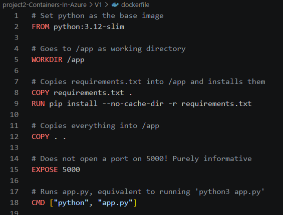

# project2-Containers-In-Azure

In this project I will learn how containers work in Azure. I will make a very minimal Docker image, and make sure that gets to Azure and is accessible (securely) to me. I will learn about Dockerfile basics (Even though I have done some in the past), port mapping, environment variables, and volumes. 

## Part 1: the app and dockerfile

First I am defining what the app will do exactly. I have decided that I want it to just return 'pong' when it is pinged. Also it checks a password. I do this to practice how secrets are stored best in Azure. 

Below is the dockerfile with comments to explain each step

